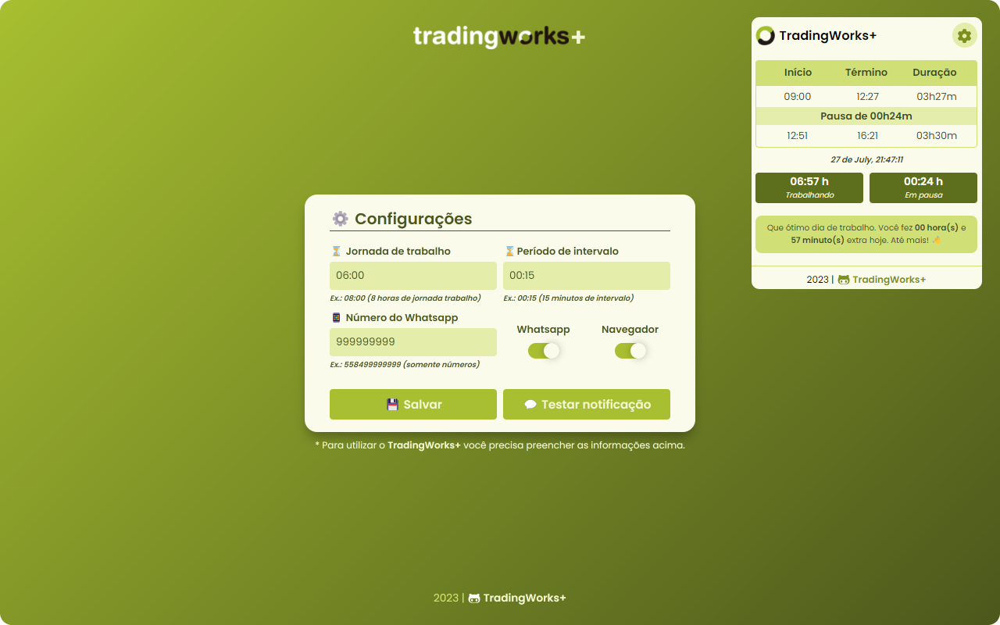
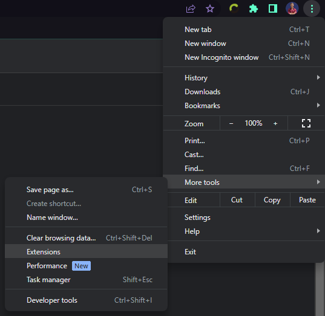
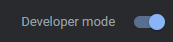
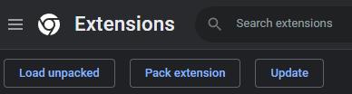
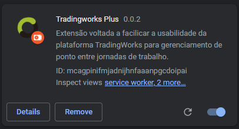

<h1 align="center">
   TradingWorks+
</h1>

<br/>

<div align="center">
  <a href="#-technologies">Technologies</a>&nbsp;&nbsp;&nbsp;|&nbsp;&nbsp;&nbsp;
  <a href="#-project">Project</a>&nbsp;&nbsp;&nbsp;|&nbsp;&nbsp;&nbsp;
  <a href="#-features">Features</a>&nbsp;&nbsp;&nbsp;|&nbsp;&nbsp;&nbsp;
  <a href="#%EF%B8%8F-use">Use</a>&nbsp;&nbsp;&nbsp;|&nbsp;&nbsp;&nbsp;
  <a href="#-support">Support</a>&nbsp;&nbsp;&nbsp;|&nbsp;&nbsp;&nbsp;
  <a href="#%EF%B8%8F-contribute">Contribute</a>&nbsp;&nbsp;&nbsp;
</div>

<br/>

<div align="center">
  
</div>

<br/>

<p align="center">
  <a href="https://github.com/ErnaneJ/tradingworks-plus/blob/master/docs/ptbr">PT-BR</a>
</p>

<br/>

<p align="center">
  
</p>


## 🚀 Technologies

This application was developed with the following technologies:

- HTML
- CSS
- Javascript

## 💻 Project

Extension developed with the aim of facilitating the usability of the TradingWorks platform for point management between workdays. His idea was due to the need for some features that are not natively present in the application.

<p align="center">
  <b>This extension has NO direct link to the TradingWorks platform and its development purpose is entirely educational.</b>
</p>

## ✨ Features

In order to make life easier for the user, this extension has the following features:

- List of schedules;
  - Prohibited;
  - Exit;
- Automatic calculation of elapsed time;
  - Elapsed time of working day;
  - Time elapsed in intervals;
  - Elapsed time of extra journey, when the pre-defined time has already been finalized.
- Notifications
  - Background execution of a journey monitor that captures this information every X time and notifies the user in specific cases through the [https://www.callmebot.com/](callmebot.com) API.
    - Notifications on Whatsapp
    - Browser Notifications

_Note: All information is captured directly from the [TradingWorks.net](https://app.tradingworks.net/) platform to ensure the accuracy of the calculations. It only needs to identify user session cookies in the browser to obtain the necessary access to enter the platform with the collaborator's profile and capture the information._

## ⚙️ Use

### 🧩 Installing from the extension store

Unfortunately it is still not possible to obtain the extension through the official store. The wish is that in the future it becomes possible. Below are listed other ways to install the extension.

### 📦 Installation by downloading packages

Below is explained the process to download and install the extension manually. None of these steps are necessary if it has been installed directly by the store.

#### ⬇️ Download

Go [here](https://github.com/ErnaneJ/tradingworks-plus/releases) to view available packages and versions (ZIP) or download directly from Git.

- Clone this repository

  - SSH
  ```bash
  git clone git@github.com:ErnaneJ/tradingworks-plus.git
  ```

  - HTTPS
  ```bash
  https://github.com/ErnaneJ/tradingworks-plus.git
    ```

#### 🟢 Install

  - Access your browser in the extensions section

  <p align="center">
    
  </p>


  - Enable development mode

  <p align="center">
    
  </p>


  - Upload the folder where you cloned the repository

  <p align="center">
    
  </p>


  - Ready! 🎊

  <p align="center">
    
  </p>

## 🆙 Support

This Extension has been tested and proven to work in the following browsers:
  - **Google Chrome**: v111.0.5563.146	(2023-03-28)
  - **Edge**: v111.0.1661.54 (2023-03-24)

## 📃 Privacy Policy

[Privacy Policy.](./docs/privacy_policy/en.md)

## ⚙️ Contribute

### 🚧 Developing

If you encounter a problem or want some new functionality, please open an issue. If you want to implement it on your own, carry out the **Installation by downloading packages** process present in the same documentation file above before starting.

With the extension working correctly, open the project in your favorite text editor and good development!

When you're done, you can open a PR and I'll be extremely happy to review and possibly accept your code!

### 💙 Encouraging

Any criticism (as long as it's constructive) is always welcome. In addition, you can make a donation to support the project if you deem it appropriate.

_One of the future goals for this extension is to publish it on the official Google Extensions store. However, to do so, you need to pay a licensing fee of $5._

<br/><p align="center">
  <a href="https://github.com/sponsors/ErnaneJ">
    
  </a>
</p><br/>

---

<div align="center">
  2023 | <b>TradingWorks+</b>
</div>