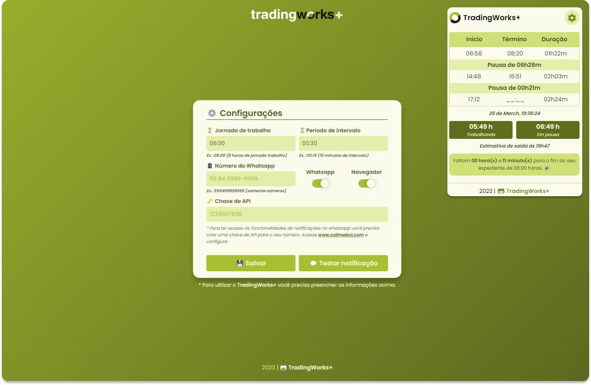
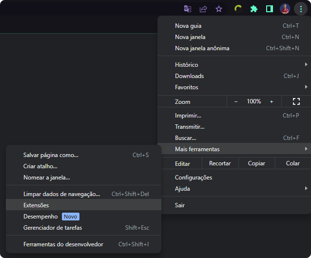
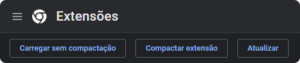
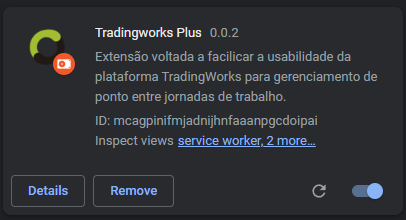

<h1 align="center">
   TradingWorks+
</h1>

<br/>

<div align="center">
  <a href="#-tecnologias">Tecnologias</a>&nbsp;&nbsp;&nbsp;|&nbsp;&nbsp;&nbsp;
  <a href="#-projeto">Projeto</a>&nbsp;&nbsp;&nbsp;|&nbsp;&nbsp;&nbsp;
  <a href="#-funcionalidades">Funcionalidades</a>&nbsp;&nbsp;&nbsp;|&nbsp;&nbsp;&nbsp;
  <a href="#%EF%B8%8F-use">Use</a>&nbsp;&nbsp;&nbsp;|&nbsp;&nbsp;&nbsp;
  <a href="#-suporte">Suporte</a>&nbsp;&nbsp;&nbsp;|&nbsp;&nbsp;&nbsp;
  <a href="#%EF%B8%8F-contribua">Contribua</a>&nbsp;&nbsp;&nbsp;
</div>

<br/>

<div align="center">
  
</div>

<br/>

<p align="center">
  <a href="https://github.com/ErnaneJ/tradingworks-plus">EN</a>
</p>

<br/>

<p align="center">
  
</p>

## 🚀 Tecnologias

Esta aplicação foi desenvolvida com as seguintes tecnologias:

- HTML
- CSS
- Javascript

## 💻 Projeto

Extensão desenvolvida com o intuito de facilicar a usabilidade da plataforma TradingWorks para gerenciamento de ponto entre jornadas de trabalho. Sua ideia se deu pela necessidade de algumas funcionalidades que não estão presentes nativamente na aplicação. 

<p align="center">
  <b>Essa extensão não possui NENHUM vínculo direto com a plataforma TradingWorks e seu objetivo de desenvolvimento é totalmente educacional.</b>
</p>

## ✨ Funcionalidades

Com o intuito de facilitar a vida do usuário, essa extensão conta com as seguintes funcionalidades:

- Listagem de horários;
  - Entrada;
  - Saída;
- Cálculo automático de tempo decorrido;
  - Tempo decorrido de jornada de trabalho;
  - Tempo decorrido em intervalos;
  - Tempo decorrido de jornada extra, quando o tempo pre-definido já estiver sido finalizado.
- Notificações
  - Execução em background de um monitor de jornada que capture essas informações a cada X tempo e notifique o usuário em casos específicos por meio da API do [https://www.callmebot.com/](callmebot.com).
  - Noticações no Whatsapp
  - Notificações no Browser


_Obs.: Todas as informações são capturadas diretamente da plataforma [TradingWorks.net](https://app.tradingworks.net/) para garantir a exatidão dos calculos. A mesma somente necessita identificar cookies de sessão do usuário no navegador para conseguir o acesso necessário para entrar na plataforma com o perfil do colaborador e realizar a captura das informações._

## ⚙️ Use

### 🧩 Instalando pela loja de extensões

Infelizmente ainda não é posível obter a extensão por meio de loja oficial. O desejo é que no futuro se torne possível. Abaixo estão listadas outras formas de instalar a extensão.

### 📦 Manualmente
Abaixo está explicado o processo para realizar o download e instalação da extensão de forma manual. Nenhum desses passos é necessário caso a mesma tenha sido instalada diretamente pela loja. 

#### ⬇️ Baixe

Acesse [aqui](https://github.com/ErnaneJ/tradingworks-plus/releases) para vizualizar os pacotes e versões disponíveis (ZIP) ou baixe diretamente pelo Git.

- Clone esse repositório

  - SSH
  ```bash
  git clone git@github.com:ErnaneJ/tradingworks-plus.git
  ```

  - HTTPS
  ```bash
  https://github.com/ErnaneJ/tradingworks-plus.git
    ```

#### 🟢 Instale

  - Acesse seu navegador na sessão de extensões

  <p align="center">
    
  </p>


  - Libere o modo de desenvolvimento

  <p align="center">
    
  </p>


  - Carregue a pasta onde você clonou o repositório

  <p align="center">
    
  </p>


  Prontinho! 🎊

  <p align="center">
    
  </p>

## 🆙 Suporte

Essa Extensão já foi testada e comprovada funcionamento nos seguintes navegadores:
  - **Google Chrome**: v111.0.5563.146	(28/03/2023)
  - **Edge**: v111.0.1661.54 (24/03/2023)

## ⚙️ Contribua

### 🚧 Desenvolvendo

Caso encontre algum problema ou deseja alguma nova funcionalidade, abra uma issue. Caso deseje implementar por conta própria realize processo de **instalação manual** presente nesse mesmo arquivo de documentação mais acima antes de iniciar.

Com a extensão funcionando corretamente, abra o projeto no seu editor de texto favorito e bom desenvolvimento!

Ao finalizar, você poderá abrir um PR e eu ficarei extremamente feliz em revisar e possivelmente aceitar seu código!

### 💙 Incentivando

Qualquer crítica (desde que contrutiva) sempre será bem-vinda. Além disso, você poderá realizar uma doação para patricinar o projeto caso julgue pertinente. 

_Um dos objetivos futuros para essa extensão é publica-la na loja oficial do Google Extensions. Entretanto, para isso, é necessário pagar uma taxa de licenciamento de $5._

<br/><p align="center">
  <a href="https://github.com/sponsors/ErnaneJ">
    
  </a>
</p><br/>

---

<div align="center">
  2023 | <b>TradingWorks+</b>
</div>